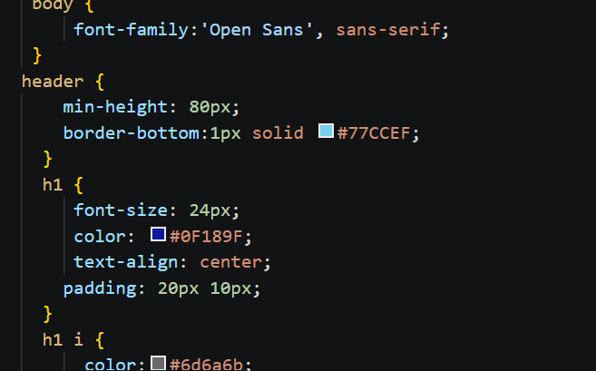

# Lab3Web
## 1. Struktur HTML Dasar
Pada tahap ini, dibuat file `lab2_css_dasar.html` yang berisi struktur dasar halaman web.
**Screenshot:**

## 2. Internal CSS
Internal CSS digunakan untuk mengatur tampilan HTML melalui tag <style>.
**Screenshot:**

